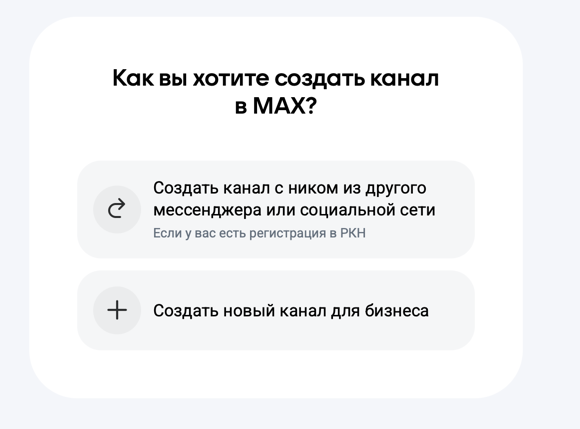
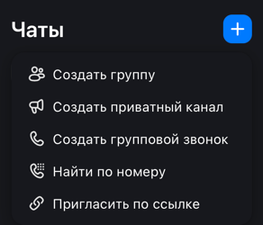

## Каналы

### ТГ

Любой пользователь может создать и приватный, и публичный канал. Приватный канал можно сделать публичным. Юзер сам может выбрать свободный юзернейм (тэг, ник) канала.

Есть комментарии к постам. Каналы могут принимать личные сообщение.

### Макс

Приватные каналы может создать любой пользователь. У таких каналов нет публичной короткой ссылки. \
А публичные каналы, у которых есть короткая ссылка, и которые можно найти в поиске, доступны только юрлицам, ИП или самозанятым. Или если у вас есть канал в ВК/ОК/Дзен/ТГ, зарегистрированный в РКН через Госуслуги.

В случае с РКН каналам будет присвоен такой же юзернейм, как и в другой соцсети. Иначе для орагнизаций тэг будет `id<ИНН>_biz` / `id<ИНН>_<N>_biz`, СЗ - `se<id>_biz`, госам - любое.

К постам нет комменатриев =(

### Полезные материалы

- [Макс - каналы](https://dev.max.ru/help/channels)
- [Макс - создание канала](https://dev.max.ru/docs/channels/create)
- [Макс - управленеие каналом](https://dev.max.ru/docs/channels/manage)
